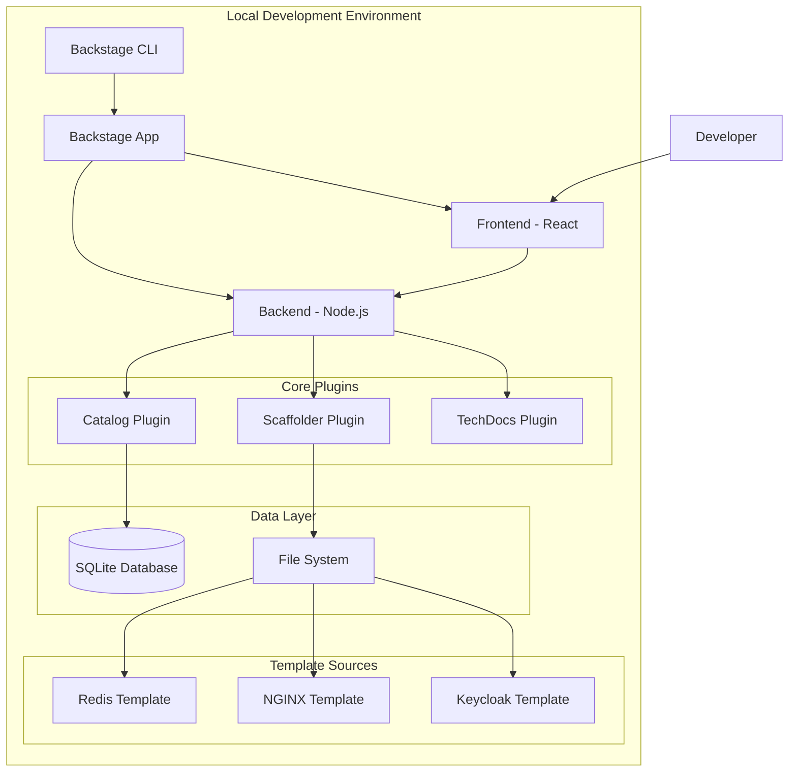

# Design Document

## Overview

This design outlines the implementation of a local Backstage development environment for testing and validating the generated templates (Redis Cluster, NGINX Web Service, and Keycloak Deployment). The solution provides a complete development setup with hot-reloading, debugging capabilities, and comprehensive template testing features.

## Architecture



## Components and Interfaces

### 1. Backstage Application Setup

**Purpose**: Core Backstage application with development configuration

**Key Components**:
- **App Configuration**: Development-optimized settings
- **Plugin Integration**: Essential plugins for template testing
- **Database Setup**: Local SQLite for development
- **Authentication**: Disabled for local development

**Configuration Structure**:
```typescript
interface BackstageConfig {
  app: {
    title: string;
    baseUrl: string;
  };
  backend: {
    baseUrl: string;
    database: DatabaseConfig;
    cors: CorsConfig;
  };
  scaffolder: {
    defaultAuthor: AuthorConfig;
    defaultCommitMessage: string;
  };
  catalog: {
    locations: LocationConfig[];
    rules: ProcessingRule[];
  };
}
```

### 2. Template Loading System

**Purpose**: Automatic discovery and loading of local templates

**Key Components**:
- **Template Discovery**: Scans local templates directory
- **Validation Engine**: Validates template YAML and structure
- **Hot Reloading**: Watches for template file changes
- **Error Reporting**: Provides detailed validation feedback

**Template Loader Interface**:
```typescript
interface TemplateLoader {
  discoverTemplates(directory: string): Promise<Template[]>;
  validateTemplate(template: Template): ValidationResult;
  watchTemplates(directory: string, callback: (templates: Template[]) => void): void;
  reloadTemplate(templatePath: string): Promise<Template>;
}
```

### 3. Development Tools Integration

**Purpose**: Enhanced development experience with debugging and testing tools

**Key Components**:
- **Template Debugger**: Step-by-step execution debugging
- **Dry Run Executor**: Test templates without side effects
- **Log Aggregator**: Centralized logging for template operations
- **Performance Monitor**: Template execution performance tracking

**Debug Interface**:
```typescript
interface TemplateDebugger {
  startDebugging(templateId: string, parameters: any): DebugSession;
  stepThrough(sessionId: string): Promise<StepResult>;
  inspectVariables(sessionId: string): VariableState;
  setBreakpoint(templateId: string, stepId: string): void;
}
```

### 4. Local File System Integration

**Purpose**: Direct integration with local template files and generated outputs

**Key Components**:
- **File Watcher**: Monitors template directory changes
- **Output Manager**: Manages generated project outputs
- **Backup System**: Creates backups of generated projects
- **Cleanup Service**: Manages temporary files and outputs

## Data Models

### Template Configuration
```typescript
interface LocalTemplate {
  id: string;
  name: string;
  description: string;
  path: string;
  metadata: TemplateMetadata;
  parameters: ParameterSchema[];
  steps: TemplateStep[];
  lastModified: Date;
  validationStatus: 'valid' | 'invalid' | 'warning';
  validationErrors: ValidationError[];
}
```

### Development Session
```typescript
interface DevelopmentSession {
  id: string;
  templateId: string;
  parameters: Record<string, any>;
  executionLog: ExecutionLogEntry[];
  status: 'running' | 'completed' | 'failed' | 'debugging';
  outputs: GeneratedOutput[];
  startTime: Date;
  endTime?: Date;
}
```

### Validation Result
```typescript
interface ValidationResult {
  isValid: boolean;
  errors: ValidationError[];
  warnings: ValidationWarning[];
  suggestions: ValidationSuggestion[];
  schemaVersion: string;
}
```

## Implementation Plan

### Phase 1: Basic Backstage Setup
1. **Initialize Backstage App**
   - Use `@backstage/create-app` to generate base application
   - Configure development settings
   - Set up local SQLite database
   - Disable authentication for development

2. **Configure Essential Plugins**
   - Install and configure Scaffolder plugin
   - Install and configure Catalog plugin
   - Install and configure TechDocs plugin
   - Set up plugin routing and navigation

### Phase 2: Template Integration
1. **Template Discovery System**
   - Implement file system scanner for templates
   - Create template validation engine
   - Set up automatic template registration
   - Implement error reporting system

2. **Hot Reloading Implementation**
   - Set up file watchers for template directories
   - Implement template reload mechanism
   - Create change notification system
   - Add development mode indicators

### Phase 3: Development Tools
1. **Debugging Capabilities**
   - Implement template execution debugger
   - Create step-by-step execution viewer
   - Add variable inspection tools
   - Set up breakpoint system

2. **Testing and Validation**
   - Implement dry-run execution
   - Create template validation dashboard
   - Add performance monitoring
   - Set up automated testing tools

### Phase 4: User Experience Enhancements
1. **Development Dashboard**
   - Create template management interface
   - Add execution history viewer
   - Implement template comparison tools
   - Set up development metrics

2. **Documentation and Help**
   - Generate interactive template documentation
   - Create development guides
   - Add contextual help system
   - Implement template examples

## Configuration Files

### app-config.local.yaml
```yaml
app:
  title: Template Development Environment
  baseUrl: http://localhost:3000

backend:
  baseUrl: http://localhost:7007
  listen:
    port: 7007
  database:
    client: better-sqlite3
    connection: ':memory:'
  cors:
    origin: http://localhost:3000

scaffolder:
  defaultAuthor:
    name: Template Developer
    email: developer@example.com
  defaultCommitMessage: 'Initial commit from template'

catalog:
  locations:
    - type: file
      target: ./templates/*/template.yaml
  rules:
    - allow: [Template, Component, API, Resource, System, Domain]

techdocs:
  builder: 'local'
  generator:
    runIn: 'local'
  publisher:
    type: 'local'
```

### Development Scripts
```json
{
  "scripts": {
    "dev": "backstage-cli package start",
    "start": "backstage-cli package start --config app-config.yaml --config app-config.local.yaml",
    "build": "backstage-cli package build",
    "test": "backstage-cli package test",
    "lint": "backstage-cli package lint",
    "validate-templates": "node scripts/validate-templates.js",
    "watch-templates": "node scripts/watch-templates.js"
  }
}
```

## Testing Strategy

### Unit Testing
- Template validation logic
- File system integration
- Configuration parsing
- Plugin integration

### Integration Testing
- End-to-end template execution
- Plugin interaction testing
- Database integration
- File system operations

### Manual Testing
- Template UI interaction
- Parameter form validation
- Output generation verification
- Error handling scenarios

## Security Considerations

### Local Development Security
- Disable authentication for development ease
- Restrict network access to localhost only
- Implement safe template execution sandbox
- Validate template inputs and outputs

### Template Security
- Scan templates for malicious code
- Validate template step configurations
- Restrict file system access permissions
- Monitor template execution resources

## Performance Optimization

### Template Loading
- Implement template caching
- Use incremental validation
- Optimize file watching
- Batch template updates

### Execution Performance
- Parallel step execution where possible
- Resource usage monitoring
- Memory management for large outputs
- Cleanup of temporary resources

## Error Handling

### Template Validation Errors
- Schema validation failures
- Missing required files
- Invalid step configurations
- Parameter definition errors

### Runtime Errors
- Template execution failures
- File system access errors
- Network connectivity issues
- Resource exhaustion

## Monitoring and Logging

### Development Metrics
- Template execution times
- Validation success rates
- Error frequency tracking
- Resource usage monitoring

### Logging Strategy
- Structured logging for template operations
- Debug level logging for development
- Error aggregation and reporting
- Performance metrics collection