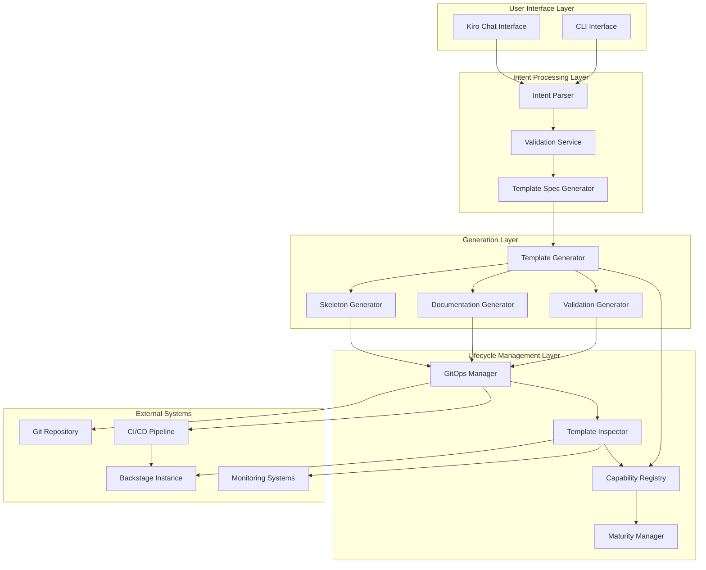

# Design Document: Backstage Template Generator

## Overview

The Backstage Template Generator is an AI-powered system that transforms developer intent into executable Backstage templates, enabling continuous expansion of IDP capabilities through automated template generation. The system leverages Kiro's Vibe Coding approach to convert natural language descriptions into complete Backstage template artifacts, including YAML configurations, skeleton repositories, validation logic, and documentation.

The system operates on the principle that IDP capability expansion should be a routine development activity rather than a specialized platform team task. By abstracting away Backstage's technical complexity, it enables domain teams to contribute directly to platform evolution while maintaining consistency and compliance with organizational standards.

## Architecture

The system follows a modular architecture with clear separation between intent processing, template generation, and lifecycle management:



## Components and Interfaces

### Intent Parser

The Intent Parser is responsible for converting natural language descriptions into structured specifications:

**Interface:**
```typescript
interface IntentParser {
  parseIntent(description: string): Promise<ParsedIntent>
  validateIntent(intent: ParsedIntent): Promise<ValidationResult>
  refineIntent(intent: ParsedIntent, feedback: string): Promise<ParsedIntent>
}

interface ParsedIntent {
  capability: string
  description: string
  requirements: string[]
  constraints: string[]
  maturityLevel: CapabilityMaturity
  phase: DevelopmentPhase
}
```

**Key Responsibilities:**
- Extract capability requirements from natural language
- Identify organizational constraints and standards
- Determine appropriate maturity level and development phase
- Generate clarifying questions for incomplete specifications

### Template Generator

The core component that produces Backstage template artifacts:

**Interface:**
```typescript
interface TemplateGenerator {
  generateTemplate(spec: TemplateSpec): Promise<GeneratedTemplate>
  validateTemplate(template: GeneratedTemplate): Promise<ValidationResult>
  previewTemplate(template: GeneratedTemplate): Promise<TemplatePreview>
}

interface GeneratedTemplate {
  yaml: string
  skeleton: SkeletonStructure
  documentation: Documentation
  validation: ValidationRules
  metadata: TemplateMetadata
}
```

**Key Responsibilities:**
- Generate complete Backstage template YAML with parameters, steps, and outputs
- Create skeleton repository structure with templated files
- Produce comprehensive documentation (TechDocs, README)
- Generate validation logic for organizational standards enforcement

### GitOps Manager

Manages the complete template lifecycle through Git-based workflows:

**Interface:**
```typescript
interface GitOpsManager {
  createTemplateRepository(template: GeneratedTemplate): Promise<Repository>
  submitForReview(repository: Repository): Promise<PullRequest>
  deployTemplate(approvedPR: PullRequest): Promise<DeploymentResult>
  updateCapabilityRegistry(deployment: DeploymentResult): Promise<void>
}
```

**Key Responsibilities:**
- Create Git repositories for new templates
- Manage pull request workflows for template review
- Automate deployment to Backstage instances
- Maintain capability registry with current template status

### Capability Registry

Centralized registry for tracking IDP capabilities and their maturity:

**Interface:**
```typescript
interface CapabilityRegistry {
  registerCapability(capability: Capability): Promise<void>
  getCapabilities(filter?: CapabilityFilter): Promise<Capability[]>
  updateMaturity(capabilityId: string, level: CapabilityMaturity): Promise<void>
  suggestImprovements(capabilityId: string): Promise<Improvement[]>
}

interface Capability {
  id: string
  name: string
  description: string
  maturityLevel: CapabilityMaturity
  phase: DevelopmentPhase
  templates: Template[]
  dependencies: string[]
}
```

### Template Inspector

Post-deployment monitoring and health verification component:

**Interface:**
```typescript
interface TemplateInspector {
  performHealthCheck(templateId: string): Promise<HealthCheckResult>
  monitorTemplateUsage(templateId: string): Promise<UsageMetrics>
  validateTemplateIntegrity(templateId: string): Promise<IntegrityReport>
  generateDiagnosticReport(templateId: string): Promise<DiagnosticReport>
  triggerRollback(templateId: string, reason: string): Promise<RollbackResult>
  trackPerformanceMetrics(templateId: string): Promise<PerformanceMetrics>
  verifyDependencyCompatibility(templateId: string): Promise<CompatibilityReport>
  performRegressionTesting(templateId: string): Promise<RegressionTestResult>
}

interface HealthCheckResult {
  templateId: string
  status: 'healthy' | 'degraded' | 'failed'
  checks: HealthCheck[]
  timestamp: Date
  recommendations: string[]
}

interface HealthCheck {
  name: string
  status: 'pass' | 'warn' | 'fail'
  message: string
  details?: Record<string, any>
}

interface UsageMetrics {
  templateId: string
  totalExecutions: number
  successRate: number
  averageExecutionTime: number
  failureReasons: FailureReason[]
  userSatisfactionScore: number
  lastUsed: Date
}

interface DiagnosticReport {
  templateId: string
  issues: Issue[]
  performanceAnalysis: PerformanceAnalysis
  dependencyStatus: DependencyStatus[]
  remediationSuggestions: RemediationSuggestion[]
  generatedAt: Date
}
```

**Key Responsibilities:**
- Perform comprehensive health checks on deployed templates
- Monitor template usage patterns and success rates
- Validate template accessibility and functionality
- Generate diagnostic reports with remediation suggestions
- Trigger automated rollback procedures for failed templates
- Track performance metrics and user satisfaction
- Verify dependency compatibility and update mappings
- Perform regression testing for template updates

## Data Models

### Template Specification

```typescript
interface TemplateSpec {
  metadata: {
    name: string
    description: string
    tags: string[]
    owner: string
  }
  parameters: JSONSchema
  steps: TemplateStep[]
  output: TemplateOutput
  validation: ValidationRules
}

interface TemplateStep {
  id: string
  name: string
  action: string
  input: Record<string, any>
  if?: string
}
```

### Capability Maturity Model

```typescript
enum CapabilityMaturity {
  L1_GENERATION = "L1_GENERATION",           // Basic automation
  L2_DEPLOYMENT = "L2_DEPLOYMENT",           // Deployment automation
  L3_OPERATIONS = "L3_OPERATIONS",           // Operational standardization
  L4_GOVERNANCE = "L4_GOVERNANCE",           // Policy enforcement
  L5_INTENT_DRIVEN = "L5_INTENT_DRIVEN"     // Intent-based execution
}

enum DevelopmentPhase {
  FOUNDATION = "FOUNDATION",
  STANDARDIZATION = "STANDARDIZATION", 
  OPERATIONALIZATION = "OPERATIONALIZATION",
  GOVERNANCE = "GOVERNANCE",
  INTENT_DRIVEN = "INTENT_DRIVEN"
}
```

### Validation Rules

```typescript
interface ValidationRules {
  security: SecurityRule[]
  compliance: ComplianceRule[]
  standards: StandardRule[]
  cost: CostRule[]
}

interface SecurityRule {
  type: "baseline" | "classification" | "access"
  rule: string
  enforcement: "warn" | "block"
}
```

Now I need to use the prework tool to analyze the acceptance criteria before writing the Correctness Properties section:
## Correctness Properties

*A property is a characteristic or behavior that should hold true across all valid executions of a system—essentially, a formal statement about what the system should do. Properties serve as the bridge between human-readable specifications and machine-verifiable correctness guarantees.*

### Property 1: Intent Parsing Completeness
*For any* natural language capability description, the Intent_Parser should extract all key requirements, constraints, and metadata needed to generate a complete Template_Spec
**Validates: Requirements 1.1, 5.1**

### Property 2: Template Generation Completeness  
*For any* valid Template_Spec, the Template_Generator should produce a complete set of artifacts including valid Backstage YAML, skeleton repository structure, validation logic, and documentation
**Validates: Requirements 1.2, 1.3, 1.4, 1.5, 5.3**

### Property 3: GitOps Workflow Consistency
*For any* template creation or modification, the system should consistently execute the complete GitOps workflow: Git commit → CI/CD trigger → PR creation → merge → deployment → registry update
**Validates: Requirements 2.1, 7.1, 7.2, 7.3, 7.4, 2.4, 7.5**

### Property 4: Maturity Progression Logic
*For any* capability at maturity level N, the system should enable progression to level N+1 when appropriate conditions are met and provide roadmap recommendations
**Validates: Requirements 3.1, 3.2, 3.3, 3.4, 3.5**

### Property 5: Phase-Appropriate Template Support
*For any* development phase, the Template_Generator should support only the template types and capabilities appropriate for that phase level
**Validates: Requirements 4.1, 4.2, 4.3, 4.4, 4.5**

### Property 6: Interactive Specification Completion
*For any* incomplete intent specification, the Template_Generator should ask clarifying questions until all required information is obtained
**Validates: Requirements 5.2**

### Property 7: Cross-Artifact Consistency
*For any* generated template, all artifacts (YAML, TypeScript, documentation) should maintain semantic consistency and reference the same entities and parameters
**Validates: Requirements 5.4**

### Property 8: Comprehensive Validation Enforcement
*For any* generated template, the system should validate against all applicable organizational standards: coding standards, security baselines, data classification, cost controls, and governance policies
**Validates: Requirements 6.1, 6.2, 6.3, 6.4, 6.5**

### Property 9: Template Discovery and Reuse
*For any* template search or reuse scenario, the system should provide complete metadata, suggest composition over duplication, and support parameterization
**Validates: Requirements 8.1, 8.2, 8.3, 8.4**

### Property 10: Conflict Resolution and Migration
*For any* template conflict or deprecation scenario, the system should provide actionable resolution recommendations or migration paths
**Validates: Requirements 2.5, 8.5**

### Property 11: Preview and Validation Before Deployment
*For any* ready template, the system should provide preview functionality and validation results before allowing deployment
**Validates: Requirements 5.5**

### Property 12: Deployment Verification
*For any* approved template, the system should successfully deploy to the Backstage instance and verify the deployment was successful
**Validates: Requirements 2.3**

### Property 13: Post-Deployment Health Monitoring
*For any* deployed template, the Template_Inspector should continuously monitor health status and detect issues before they impact users
**Validates: Requirements 9.1, 9.3**

### Property 14: Template Functionality Validation
*For any* deployed template, the Template_Inspector should validate accessibility, parameter validation, and step execution functionality
**Validates: Requirements 9.2**

### Property 15: Automated Issue Detection and Remediation
*For any* template health check failure, the Template_Inspector should generate diagnostic reports and trigger appropriate remediation actions
**Validates: Requirements 9.4, 9.5**

### Property 16: Performance and Usage Tracking
*For any* deployed template, the Template_Inspector should track performance metrics, usage patterns, and user satisfaction scores
**Validates: Requirements 9.6**

### Property 17: Dependency Compatibility Verification
*For any* template with dependencies, the Template_Inspector should verify compatibility when dependencies change and update mappings accordingly
**Validates: Requirements 9.7**

### Property 18: Regression Testing for Updates
*For any* template update, the Template_Inspector should perform regression testing to ensure backward compatibility
**Validates: Requirements 9.8**

## Error Handling

The system implements comprehensive error handling across all components:

### Intent Parsing Errors
- **Ambiguous Intent**: When intent descriptions are unclear, the system prompts for clarification rather than making assumptions
- **Missing Context**: When organizational context is insufficient, the system requests additional information
- **Invalid Requirements**: When extracted requirements conflict with organizational constraints, the system flags conflicts for resolution

### Template Generation Errors
- **Invalid Specifications**: Malformed Template_Specs are rejected with detailed error messages
- **Resource Conflicts**: When templates would create conflicting resources, the system suggests alternatives
- **Validation Failures**: Templates that fail organizational standards are blocked with specific remediation guidance

### GitOps Workflow Errors
- **Repository Access**: Git authentication and permission errors are handled with clear user guidance
- **CI/CD Failures**: Pipeline failures trigger notifications with failure details and suggested fixes
- **Merge Conflicts**: Automatic conflict detection with manual resolution workflows

### Deployment Errors
- **Backstage Integration**: API failures and configuration errors are logged with recovery procedures
- **Registry Inconsistencies**: Capability registry sync issues trigger reconciliation processes
- **Rollback Procedures**: Failed deployments automatically trigger rollback to previous stable state

## Testing Strategy

The system employs a dual testing approach combining unit tests for specific scenarios and property-based tests for comprehensive validation:

### Unit Testing Focus
- **Specific Examples**: Test concrete intent descriptions and their expected Template_Spec outputs
- **Edge Cases**: Test boundary conditions like empty inputs, maximum parameter counts, and complex nested structures
- **Error Conditions**: Test all error scenarios with appropriate error messages and recovery procedures
- **Integration Points**: Test interactions between components with mock external dependencies

### Property-Based Testing Focus
- **Universal Properties**: Test that all properties hold across randomly generated inputs
- **Input Coverage**: Generate diverse intent descriptions, Template_Specs, and system states
- **Invariant Preservation**: Verify system invariants are maintained across all operations
- **Comprehensive Validation**: Test all validation rules across wide input ranges

### Testing Configuration
- **Property Test Framework**: Use Hypothesis (Python) or fast-check (TypeScript) for property-based testing
- **Test Iterations**: Minimum 100 iterations per property test to ensure comprehensive coverage
- **Test Tagging**: Each property test tagged with format: **Feature: backstage-template-generator, Property {number}: {property_text}**
- **Continuous Integration**: All tests run on every commit with failure notifications

### Test Data Management
- **Synthetic Data**: Generate realistic but synthetic organizational data for testing
- **Template Variations**: Create diverse template types across all maturity levels and phases
- **Backstage Mocking**: Mock Backstage API responses for consistent testing environments
- **Git Simulation**: Use in-memory Git repositories for GitOps workflow testing

The testing strategy ensures both correctness of specific behaviors and robustness across the full input space, providing confidence in the system's reliability and compliance with organizational requirements.