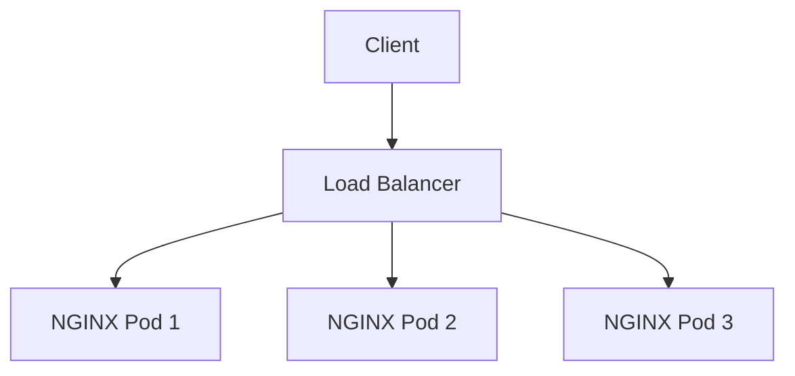

# nginx-test-service

## 개요

NGINX 테스트 웹서비스 - Backstage 템플릿으로 생성된 정적 사이트

이 프로젝트는 NGINX 기반 웹 서비스로, 다음과 같은 특징을 가지고 있습니다:

- **서비스 타입**: static-site
- **NGINX 버전**: 1.25
- **레플리카 수**: 3개
- **도메인**: localhost

## 아키텍처

## 주요 기능

### 웹 서비스 기능
- **정적 사이트 호스팅**: HTML, CSS, JavaScript 파일 서빙
- **캐싱**: 정적 자산에 대한 효율적인 캐싱

### 성능 최적화
- **Gzip 압축**: 응답 데이터 압축으로 대역폭 절약

### 보안 기능
- **커스텀 에러 페이지**: 사용자 친화적인 오류 페이지

### 모니터링 및 로깅
- **접근 로그**: combined 형식의 상세 로그

## 배포 정보

- **배포 타입**: docker-compose
- **포트**: 8082 (HTTP)
- **메트릭 포트**: 9114 (Prometheus)

## 빠른 시작

서비스를 시작하려면 [Getting Started](getting-started.md) 가이드를 참조하세요.

## 문서 구조

- [Getting Started](getting-started.md) - 개발 환경 설정 및 첫 배포
- [Configuration](configuration.md) - 상세 설정 옵션
- [Deployment](deployment.md) - 배포 가이드 (Docker Compose, Kubernetes)
- [Monitoring](monitoring.md) - 모니터링 및 알림 설정
- [Security](security.md) - 보안 설정 및 모범 사례
- [Troubleshooting](troubleshooting.md) - 문제 해결 가이드

## 지원 및 문의

문제가 발생하거나 질문이 있으시면 다음을 참조하세요:

- [Troubleshooting 가이드](troubleshooting.md)
- [GitHub Issues](https://github.com/test-org/nginx-test-service/issues)
- Platform Team 연락처